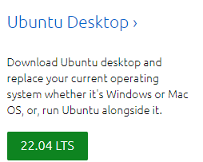
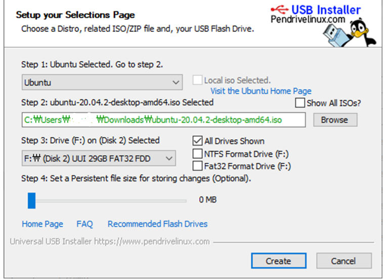

---
### Access the Linux (Ubuntu) official website

Preparing a USB required for booting (more than 16GB) formatting with quick format

### Download the iso file for installation from the Ubuntu site

[URL](https://ubuntu.com/#download)

As of July 19, 2022

Download file information: 3.4G

### After downloading the USB installer, run the installation file

[URL](https://universal-usb-installer.kr.uptodown.com/windows/download)

### Disk drive configuration and capacity allocation for Linux installation

> 1. Go to Control Panel and click System and Security - Administrative Tools Create and format hard disk partitions.
> * It may vary depending on the purpose, but if you do not intend to use the OS for a professional server, it is okay to allocate about 60 gigabytes allocated to the existing C drive and use it as a disk for Linux (minimum requirements are satisfied)
> 2. After selecting the existing C drive, right-click and click the Shrink Volume menu.
> 3. Enter 60 GB (60000) in the space to shrink field (it may be different for each PC)
> 4. Changing Secure Boot option in Window OS Shutdown Settings and BIOS Setup
> * Control Panel > Hardware and Sound > Power Options > System Settings
> * Turn off fast startup (OFF)
> 5. After restarting Window, press F2 repeatedly (it may be different for each PC)
> * Security -> Secure Boot Configuration
> * Change Secure Boot Option to Disabled
> 6. Change boot priority in BIOS menu after restart 
> 7. Change the priority so that the USB for Linux OS installation has priority 1 in the BIOS menu and save.
> 8. Click Install Ubuntu and click Korean in the language selection box.

[Reference Link](https://dreamdeveloper403.tistory.com/28?category=824174)