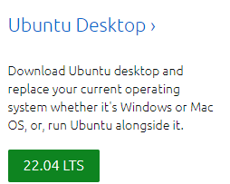

---
### Linux(Ubuntu) 공식 홈페이지 접속

부팅 시 필요한 USB 준비(16GB이상) 빠른 포맷으로 포맷

### 우분투 사이트에서 설치용 iso 파일을 다운로드

[사이트 URL](https://ubuntu.com/#download)

2022년 7월 19일 기준

다운로드 파일 정보 : 3.4G

### USB installer를 다운로드한 후 설치 파일을 실행

[사이트 URL](https://universal-usb-installer.kr.uptodown.com/windows/download)

### 리눅스 설치할 디스크 드라이브 구성 및 용량 할당

> 1. 제어판으로 가서 시스템 및 보안 - 관리 도구 하드 디스크 파티션 만들기 및 포맷을 클릭
> * 용도에 따라서 다를 수 있겠지만 해당 OS를 전문적인 서버용으로 사용할 생각이 없다면 기존 C드라이브에 할당된 60기가 정도를 할당하여 리눅스용 디스크로 사용해도 무방함 (최소 요구사항은 만족)
> 2. 기존 C드라이브를 선택 후 마우스 오른쪽을 클릭하면 볼륨 축소 메뉴 클릭
> 3. 축소할 공간 입력 란에 60GB(60000) 입력
> 4. Window OS 종료 설정 및 BIOS 설정 에서 Secure Boot 옵션 변경하기
> * 제어판 > 하드웨어 및 소리 > 전원 옵션 > 시스템 설정
> * 빠른 시작 켜기 해제 (OFF)
> 5. Window 다시 시작 후 F2 연타 ( PC별로 다를 수 있음 )
> * Security -> Secure Boot Configuration
> * Secure Boot Option 을 Disabled로 변경
> 6. 재시작 후 BIOS 메뉴에서 부팅 우선순위 바꾸기 
> 7. BIOS 메뉴에서 리눅스 OS 설치용 USB가 우선순위 1로 되도록 우선순위 변경 후 저장
> 8. Install Ubuntu 클릭 및 언어 선택란에 한국어 클릭

[참고링크](https://dreamdeveloper403.tistory.com/28?category=824174)